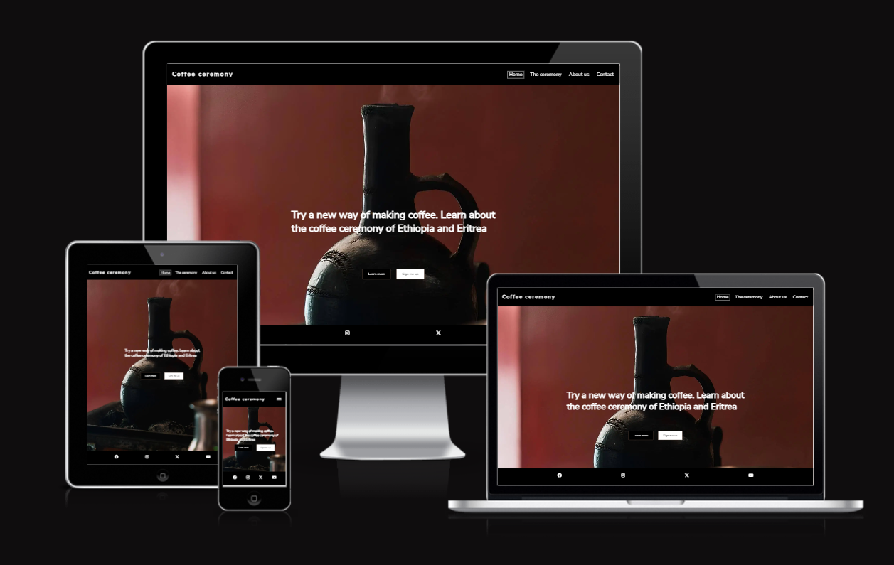
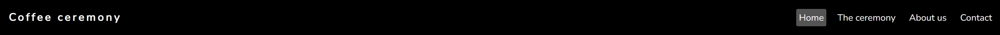

# Coffee ceremony

Coffee ceremony is a website intended for coffee lovers and coffee drinkers with a curiosity and interest in other traditions and cultures. Coffee ceremony will introduce the user to the coffe ceremony of Ethiopia and Eritrea. The user will be offered an oppurtunity to sign up for a class and learn how to make the traditonal coffee from start to end.

The live link can be found here - [Coffee ceremony](https://milentecle.github.io/coffee-ceremony/)

## Contents

- [Site Owner Goals](#site-owner-goals)

- [User Stories](#user-stories)
  - [First time user](#first-time-user)

- [Design](#design)
  - [Images](#images)
  - [Colours](#colours)
  - [Fonts](#fonts)
  - [Wireframes](#wireframes)

- [Features](#features)
  - [Navigation](#navigation)
  - [The Home Page](#the-home-page)
  - [The Ceremony Page](#the-ceremony-page)
  - [About us Page](#about-us-page)
  - [Contact Page](#contact-page)
  - [Footer](#footer)
  - [Features left to implement](#features-left-to-implement)

- [Technologies used](#technologies-used)

- [Languages](#languages)
- [Frameworks, Libraries and Programs](#frameworks-libraries-programs)
- [Known bugs](#know-bugs)
- [Testing](#testing)

- [Validator Testing](#validator-testing)
  - [HTML](#html)
  - [CSS](#css)
  - [Accessibility](#accessibility)
- [Form Testing](#form-testing)
- [Links Testing](#links-testing)
- [Browser Testing](#browser-testing)
- [Device Testing](#device-testing)
- [Friends and Family](#friends-and-family)
- [Deployment](#deployment)
- [Credits](#credits)
  - [Code](#code)
  - [Content](#content)
  - [Media](#media)
  - [Acknowledgements](#acknowledgements)

 ## Site Owner Goals

To share information with the user about the wonderful coffee ceremony and an oppurtunity to try another way of drinking, and enjoying coffee.
Create curiosity and interest with clear and easily accessible information for the user.
A website that is easy to navigate, responsive and gives the user a taste of the coffee ceremony, by using the right colors and images.
To give the user clear instructions on how to sign up for a coffee ceremony class, and the possibility for a membership.

## User Stories
- ### First time user
  - As a first time user I want to understand the main purpose of the site and learn about the coffee ceremony of Ethiopia and Eritrea.
  - As a first time user I want to be able to navigate easily through the website. 
  - As a first time user I want to be able to easily find contact details should I have any questions before booking a class.

- ### Returning User
  - As a returning visitor I already understand the concept and purpose of the site.
  - As a returing visitor I have the opportunity to sign up for a membership.

  ## Design

### Images
The images used on the Coffee ceremony site are of great importance for the user experience. The images are carefully selected to provide a clear context, and reinforce the content as the concept is new to many users. The dark elements in the pictures are also a good complement to the color scheme of the site.

### Colours
The colour scheme of the website is black, brown and gray, common colors for coffee websites.

### Fonts
The Nunito Sans font is the font used on the whole website. The font was imported via [Google Fonts](https//:fonts.google.com). Sans Serif is the backup font.

## Wireframes
The wireframes were produces via Balsamiq.

[Desktop Wireframe](docs/wireframes/Desktop.png) 

[Mobile Wireframe](docs/wireframes/Mobile.png)

## Features
 - ### Navigation

   - The navigation bar is fully responsive with four links, to help the user navigate through the site. It is visually clear which site your visiting because the acive site has ha white frame. This is enhanced with the background change when hovering over the menu links. It is also easy for the user to navigate back via the navigation bar links, and the logo that leads back to the Home page.

   - The navigation bar is fixed so it is always remains visible for the user.

   - On smaller screens the navigation bar will show a hamburger icon. The hamburger icon expands when toggled, listing the pages and showing a white frame on the active site.

- ### The Home Page 
    - The home page image is very appealing as for the purpose and curiosity. 
    - The text, together with the background image gives the user a clear visual perception of what the purpose is.
    - There are two buttons that will take the user to the "learn-more" page or to the "contact" page. The buttons will slightly change background color upon hovering.

- ### The Ceremony Page
  - The ceremony page explains what the coffee ceremony is and how it works, with an introductury text.
  - The introductury text is followed by the "How it works sections".
  - There are three steps explained with text and images.

  

- ### About us Page
  - The about us page explains what we offer to the user. The price, total amount of time and what is included are described. 
  - A "to booking" button that takes the user directly to the form for the booking.
  - A membership is also offered to returning users.

- ### Contact Page
  - The contact page is where you will find the form for booking a class.
  - Below the booking form are the contact details, such as phone, email and address. The phone number and address are generated from [Fake address](https://www.fakexy.com/se-fake-address-generator-greater-stockholm).
  - After the contact details, the user is presented with a map with the location for the coffee ceremony class.

- ### Footer
 - The footer contains social media links which takes the user to Facebook, Instagram, Twitter and Youtube.
 - The social media icons will change color when hovered over.
 - The links opens in a new tab which allows for the user to navigate easy.

### Features left to implement
  - To create a community for members with the oppurtunity to sign up for news, deals and events.

## Technologies used

## Languages 
  - HTML5
  - CSS

  ## Frameworks, Libraries and Programs
   - [Am I Responsive](https://ui.dev/amiresponsive) - Was used to ensure that the website is responsive on diffrerent devices.
   - [Responsinator](http://www.responsinator.com/) - Was also used to ensure that the website is responsive on diffrerent devices.
   - [Balsamiq](https://balsamiq.com/) - Was used to create the wireframes before starting the project.
   - [Chrome Dev Tools](https://developer.chrome.com/docs/devtools/) - Was used on a daily basis throughout the project to make changes and to test the responsivness.
   - [Font Awesome](https://fontawesome.com/) - Was used for Social Media icons in footer and for Contact information on the contact page.
   - [Github](https://github.com/) - Is where the projects code is stored. Git was used for version control by using the Gitpod terminal.
   - [Google Fonts](https://fonts.google.com/) - Was used to import fonts to the page.
   - [TinyPNG](https://tinypng.com/)- Was used to reduce the file size and keep the image quality.
   - [WEBP Converter](https://cloudconvert.com/webp-converter) - Also used to reduce the file size and keep the image quality.
   - [W3C](https://www.w3.org/)- Was used for HTML and CSS Validation.

## Known bugs
No known bugs.

## Testing

### Validator Testing
 - ### HTML
    - No errors were returned when running every page of the code through the [W3C Markup Validator](https://validator.w3.org/)
     - [W3C Markup Validator Results](docs/readme-images/w3c-markup-validator-results.png)
 - ### CSS
  - No errors were returned when running the CSS through the [W3C CSS Validator](https://jigsaw.w3.org/css-validator)
     - [W3C CSS Validator Results](docs/readme-images/css-validator-results.png)

 - ### Accessibility

### Form Testing 
 - The form has been tested to make sure the user can't submit without filling in all the fields that are requried. Once all the fields are filled in, the button to book workes as if you could book a class, fully functional.

### Links Testing
 - All navigation links on the site has been tested manually to ensure that they are working, and takes the user to the right page.
 - All the buttons were tested to ensure that the the links are working correctly.
 - All the social media links were tested seperatly to make sure they function, and opens in a new tab.

### Browser Testing
 - The Website was tested on Microsoft Edge, Google Chrome, Firefox and Safari browsers and no issus were noted.

### Device Testing
 - The website was viewed and tested on different devices such as Iphone SE, Iphone 8, Iphone 12 mini and Pro, Ipad Mini, Samsung Galaxy S21, Laptop and Desktop, to ensure that the website is responsive on diffrerent devices. Chrome developer tools was used to check the responsivness on multiple devices.
 - Additionally, I used the following websites to test the responsivness:
  - [Responsinator](http://www.responsinator.com/?url=https%3A%2F%2Fmilentecle.github.io%2Fcoffee-ceremony%2F)
  - [Am I responsive](https://ui.dev/amiresponsive?url=https://milentecle.github.io/coffee-ceremony/)

  ## Friends and Family
   - Family members and friends were asked to test the website for bugs and overall experience.

## Deployment

The project was deployed using Github pages with the following steps:
1. Go to the repository on Github.com.
2. Select 'Settings' towards the top of the page.
3. Select 'Pages' from the left menu bar.
4. Under 'Source', choose the preselected 'Branch' from the dropdown menu and then select the main branch.
5. Deployment is confirmed after a couple of minutes by this message "Your site is published at" and there is a link to the web address.

The live link can be found here - [Coffee ceremony](https://milentecle.github.io/coffee-ceremony/)

## Credits

### Code
 - I used [Stack Overflow](https://stackoverflow.co/), [W3Schools](https://www.w3schools.com/) and [CSS-tricks](https://css-tricks.com/) continuosly throughout the project to better understand concepts, and to find answers whenever I got stuck.
 - The Navigation bar including the header and the Footer were built with the help of the Love Running Project.

### Content
 - The content for the Coffee ceremony page was taken directly from [Wikipedia](https://en.wikipedia.org/wiki/Coffee_ceremony_of_Ethiopia_and_Eritrea). The rest of the content was created by the developer.

### Media
Images were taken from:
 - [Shutterstock](https://www.shutterstock.com/)
 - [Unsplash](https://unsplash.com/)

### Acknowledgements
- Antonio, my mentor, for guiding med throughout the project.
- To my family, for all the support and patience.